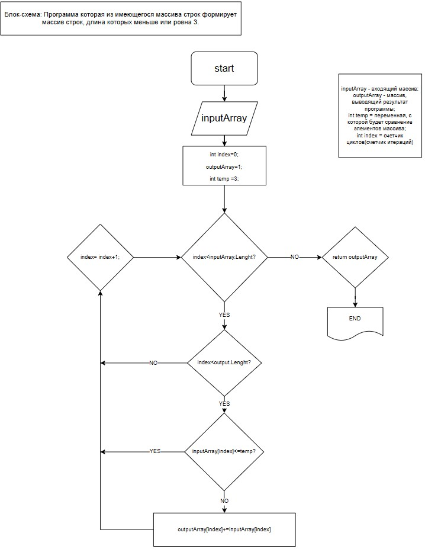

         В данной блок-схеме вы можете увидеть ряд операций с массивом строк:

 

1. На первом этапе мы вводим данные которые нужно обработать!
2. Далее создаем метод, который будет принимать эти данные в качестве аргументов.
3. После чего мы зоздаем массив, куда будут передаваться обработанные нами данные после цикла.
4. Помимо создания массива, мы инициализируем временную переменную __temp__ с которой собственно будем сравнивать наши входные данные.

5. По окончанию проверки, соблюдения всех условий цикла, мы будем выводить уже осортированный массив с обработанными в нем данными после условия проверки!

